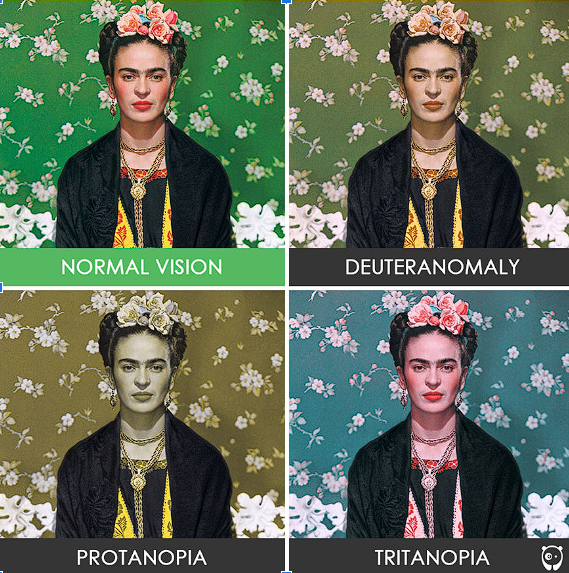
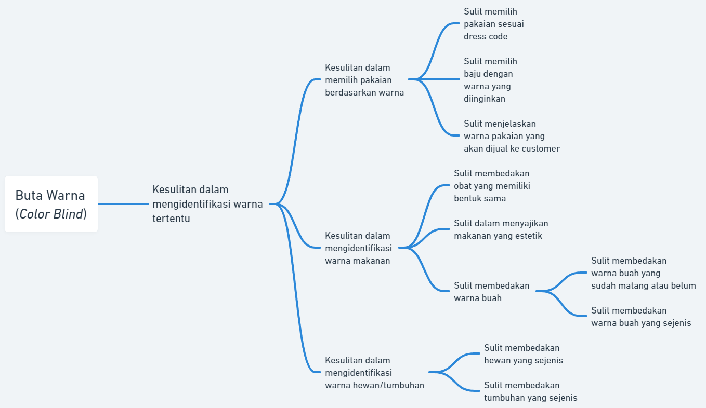

# Color_Detection_Milestone11

## Tasks

1. Create repository (Albert)
2. Computer vision with camera (Edbert)
3. Color detection (basic colors) (Edbert)
4. Adding more colors (Albert)
5. Improvement (Albert & Edbert)

## Deskripsi Masalah

Target dalam pembuatan aplikasi ini adalah mereka yang color blind atau buta warna. Dalam menjalani keseharian mereka, tentunya akan ada ketidaknyamanan saat sedang beraktivitas atau mengerjakan sesuatu. Walau mungkin terlihat tidak krusial dan berdampak besar pada hidup mereka, terkadang keterbatasan ini menjadi penghalang dimana mereka tidak yakin akan pilihan warna jika dilihat dari sudut pandang masyarakat. Orang dengan kelainan buta warna memiliki permasalahan yang terjadi di dalam kehidupan sehari-hari yang biasanya tidak dirasakan oleh orang lain seperti memilih dan menyiapkan makanan, bercocok tanam, berolahraga, mengendarai mobil, dan memilih pakaian yang akan dikenakan (colour blind awareness, 2010). Akan sangat membantu jika mereka mempunyai akses kepada pemilihan warna yang akurat, efektif, dan mudah sehingga mereka tidak perlu memusingkan kebenaran dari warna yang mereka pilih.

Buta warna atau yang juga dikenal sebagai colour vision deficiency (CVD) merupakan suatu kondisi di mana orang melihat warna secara berbeda dari kebanyakan orang. Buta warna mempengaruhi setidaknya satu dari 12 anak laki-laki dan satu dari 200 anak perempuan di seluruh dunia. Kondisi tersebut dapat membuat seseorang sangat sulit untuk mengidentifikasi dan membedakan antara berbagai warna.  

Menurut Akbari (2011), buta warna adalah penyakit kelainan pada mata yang ditentukan oleh gen resesif pada kromosom seks, khususnya terpaut pada kromosom X atau kondisi ketika sel-sel retina tidak mampu merespon warna dengan semestinya.
Sedangkan, Menurut Zenny (2012), buta warna adalah suatu kelainan yang disebabkan ketidakmampuan sel-sel kerucut mata untuk menangkap suatu spektrum warna tertentu sehingga warna yang kita lihat tidak terlihat sesuai dengan warna yang dilihat mata normal. 

Berdasarkan literatur yang kami baca, orang dengan kelainan buta warna melihat warna sebagai berikut: 

Berdasarkan tingkatannya buta warna dikelompokkan menjadi tiga jenis. Yang pertama, Anomali Trikomat (Anomalous trichromacy), yang pengelompokannya dibagi menjadi, Protanomaly (lemah merah), Deuteranomaly (lemah hijau), dan Tritanomaly (lemah biru). Yang kedua, Dichromat (Dichromacy), Gangguan buta warna dikromat dibagi menjadi tiga jenis, yaitu Protanopia (buta warna merah), Deuteranopia (buta warna hijau), dan Tritanopia (buta warna biru). Dan yang terakhir, Monochromat (Monochromacy) yang pengelompokannya terbagi menjadi, Rod monochromacy (typical) dan Cone monochromacy (atypical). 

Dengan visualisasi yang ditampilkan diatas, tentunya mereka akan memiliki kesulitan dalam memilih pakaian dengan warna yang sesuai dengan kemauan mereka. 

---

> Dekomposisi Masalah  > 

## Deskripsi Solusi

Dengan memanfaatkan perkembangan teknologi yang telah ada sekarang, kami sebagai mahasiswa Teknik Informatika dan Sistem Teknologi Informasi yang memiliki rasa empati terhadap kondisi buta warna yang diderita oleh sebagian orang, memutuskan untuk mendesain Color Detection App for Color Blind People. Color Detection App for Color Blind People adalah sebuah aplikasi yang dirancang khusus untuk membantu orang-orang dengan gangguan penglihatan warna. Aplikasi ini bertujuan untuk membantu pengguna dengan daltonisme dengan mengidentifikasi warna yang ada di sekitar mereka. Dengan menggunakan kamera ponsel atau perangkat lain, aplikasi akan mengenali warna objek dalam pandangan dan menginformasikan pengguna tentang warna tersebut. 

## How to Use

- Buka aplikasi
- Pada homepage akan ada 5 tombol yang dapat diakses

Kamera :

- Kamera laptop / pc akan menyala dan mendeteksi objek yang berada di tengah kamera
- Akan ditampilkan warna yang terdeteksi di samping objek
- Di bagian tengah bawah aplikasi ada tombol untuk memfoto layar, jika ditekan maka gambar layar akan disimpan
- Di bagian kanan bawah ada tombol untuk mematikan dan meyalakan kamera
- Di bagian kiri atas ada tombol back, jika ditekan akan membawa layar kembali ke halaman utama

About :

- Menampilkan fungsi, definisi, dan nama pembuat aplikasi
- Di bagian kiri bawah ada tombol back, jika ditekan akan membawa layar kembali ke halaman utama

Help :

- Menampilkan instruksi cara penggunaan aplikasi
- Di bagian kiri bawah ada tombol back, jika ditekan akan membawa layar kembali ke halaman utama

Exit :

- Akan keluar dari aplikasi dan mematikan program

Folder :

- Akan membuka folder berisi file foto yang telah difoto pada halaman kamera
- Jika file ditekan, akan menampilkan foto tersebut
- Di bagian kiri bawah ada tombol back, jika ditekan akan membawa layar kembali ke halaman utama

## Lembar Kontribusi

## Reference

https://pysource.com/2021/10/19/simple-color-recognition-with-opencv-and-python/
https://www.geeksforgeeks.org/multiple-color-detection-in-real-time-using-python-opencv/
https://www.geeksforgeeks.org/real-time-object-color-detection-using-opencv/
https://medium.com/analytics-vidhya/how-to-build-your-first-desktop-application-in-python-7568c7d74311
